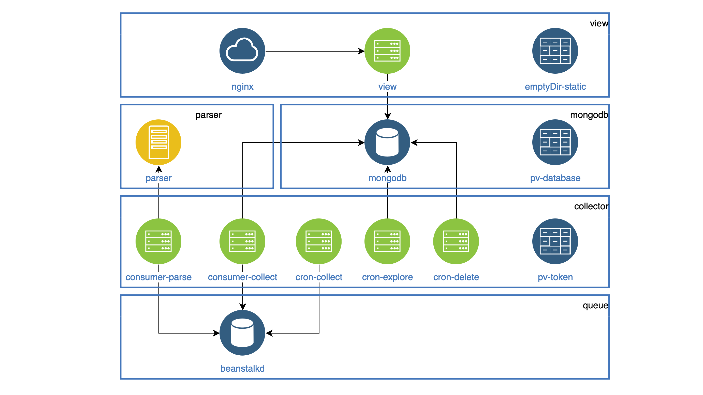

# Rent k8s configs



Создание конфигов nginx
```bash
kubectl create configmap configmap-tmp --from-file=view/default.conf
kubectl get configmaps configmap-tmp -o yaml > view/configmap.yaml
kubectl delete configmaps configmap-tmp
```

Создание файла секретов из .env файла
```bash
kubectl create secret generic secrets-tmp --from-env-file=collector/secrets.properties
kubectl get secret secrets-tmp -o yaml > collector/secrets.yaml
kubectl delete secrets secrets-tmp
```

Создание файла конфигураций из .env файла
```bash
kubectl create configmap configmap-tmp --from-env-file=collector/env.properties
kubectl get configmap configmap-tmp -o yaml > collector/configmap.yaml
kubectl delete configmap configmap-tmp
```

Получение yaml конфигов
```bash
kubectl get service service-name -o yaml --export
```

Подключится к контейнеру
```bash
kubectl exec -it pod-name -c container-name /bin/bash
```

Просмотривать новые логи контейнера(если они пишутся в stdout/stderr)
```bash
kubectl logs -f pod-name -c container-name
```

Посмотреть информацию о поде
```bash
kubectl describe pods pod-name
```

Получить список
```bash
kubectl get nodes
kubectl get deployments
kubectl get pods
kubectl get namespaces
kubectl get services
kubectl get pvc
kubectl get cronjobs
kubectl get jobs
kubectl get ingress
```

Применить конфиг
```bash
kubectl apply -f  config.yaml
```

Удалить конфиг
```bash
kubectl delete -f  config.yaml
```